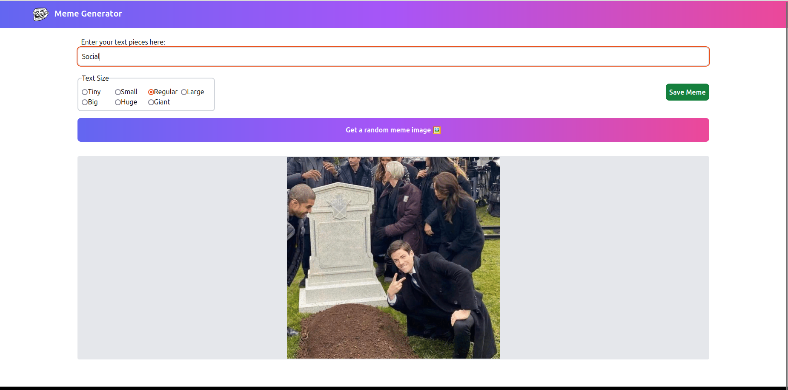
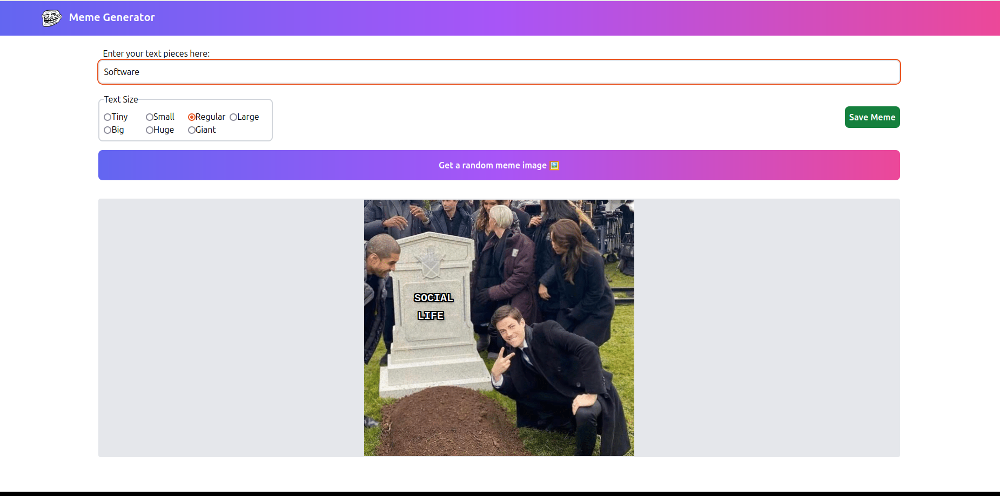
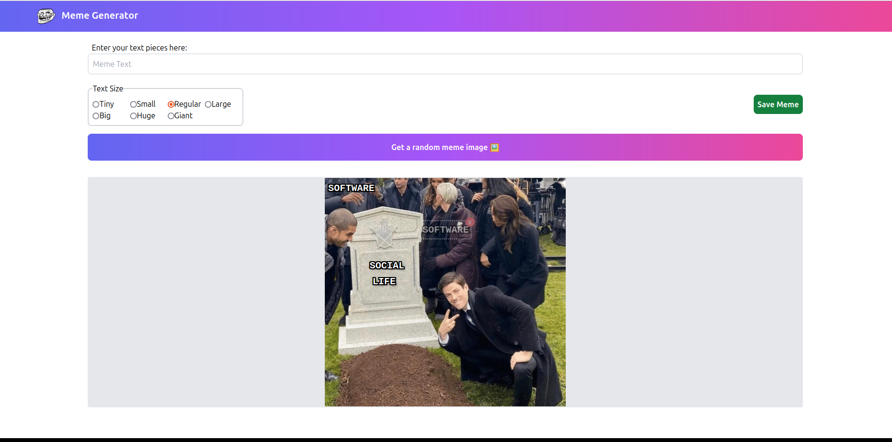
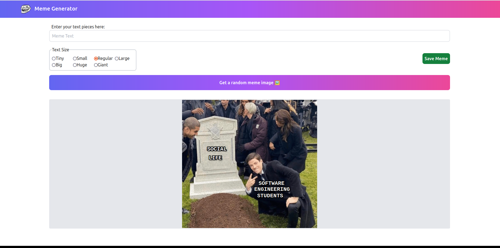
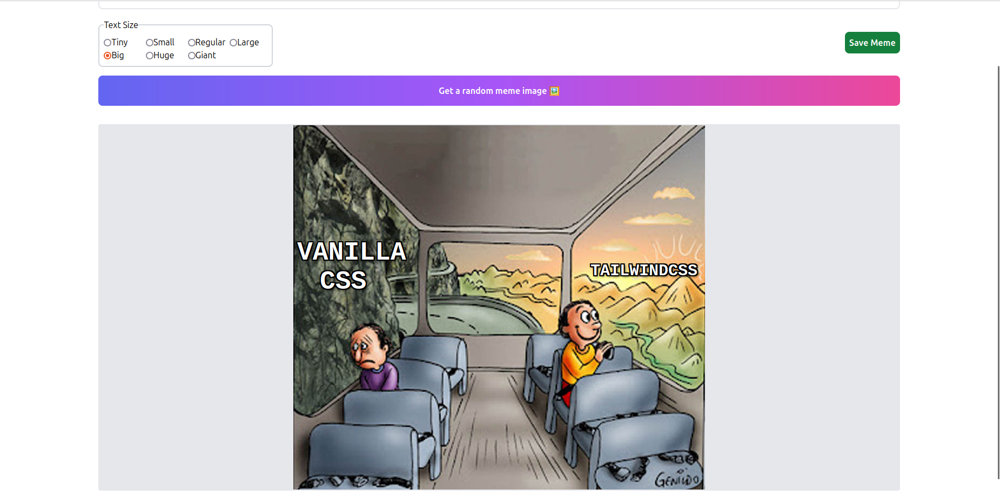

# DJS07 - Meme Generator

## Using this App
1. Get a random Meme image using the "Get a random meme image" button.
2. Select your text size.
3. Enter you text bits into the "Meme Text box". Hit "Enter" to create it.
4. Move your text bit where you want it on the image.
5. Repeat steps 2-4 as many times as you like.
6. Hit "Save" to create and download your newly created meme!

## Notes
Built as part of a bootcamp project. Extended to allow various text sizes, allow user full control over text positioning and make image exportable to JPEG.

## Examples

#### Adding Text

#### Dragging Text into position

#### Finished Examples

